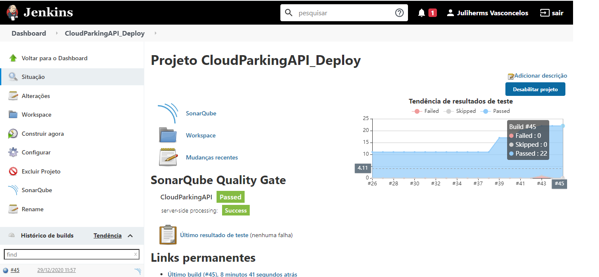

# Cloud Parking API

Application example using spring boot responsible for controlling vehicle parking

### Tools

- Java SE Development Kit
- Spring Tools IDE
- Maven
- Docker
- ModelMapper
- Swagger
- Prometheus
- Grafana
- RestAssured
- Mockito
- Postgres
- TestContainers
- Sonar
- Jenkins
- Lombok

## Built with:

- [Spring Boot](https://spring.io/projects/spring-boot)
- [Maven](https://maven.apache.org/)

### Requeriments

- The project follows [**CloudNative**](https://www.cncf.io/) recommendations and The [**twelve-factor app**](https://12factor.net/) . 


### Challenges in microservices architecture

- Configuration Management
- Dynamic Scalling Up and Down
- Load Distribution
- Visibility and Monitoring
- Common Feature Implementation
- Fault Tolerance

## Solution

### Services

| Service Name             | Port       | Description                                       |
|--------------------------|------------|---------------------------------------------------|
| Prometheus               | 9090       | Responsible to captura(scrap) metrics in the API  |
| Grafana                  | 3000       | Diplay metrics on graphics                        | 
| Postgres Database        | 5432       | Storage data parkings                             |
| Sonar                    | 9000       | Responsible to Scan and check code quality        |
| Jenkins                  | 8083       | Responsible to provide automatic build            |
| Cloud Parking API        | 8080       | Management Parkings Solution                      |


### Jenkins




### Setup Containers

```sh
docker-compose up
```

