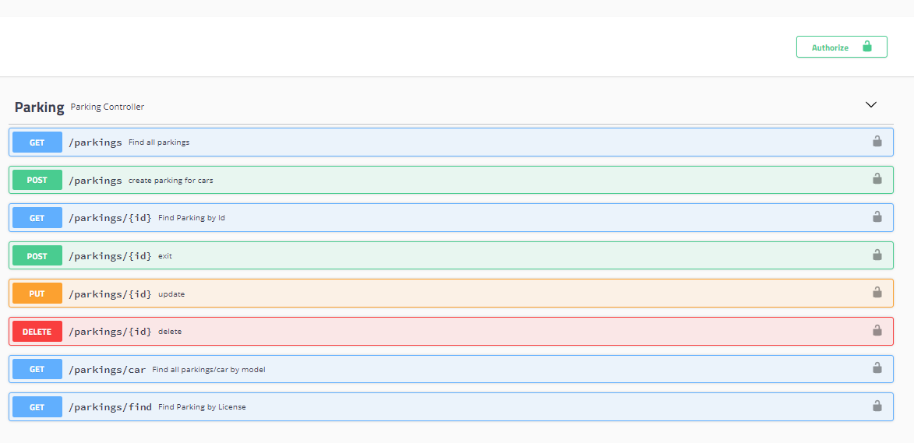
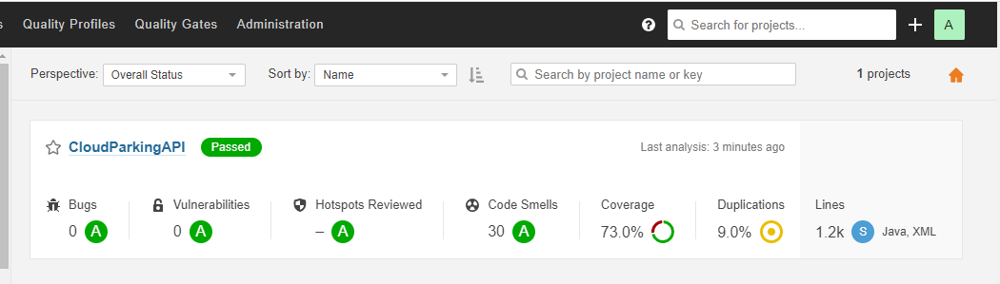
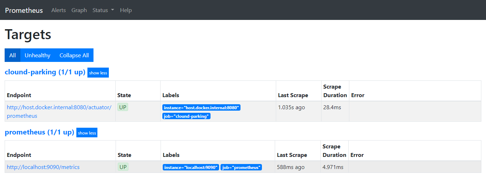
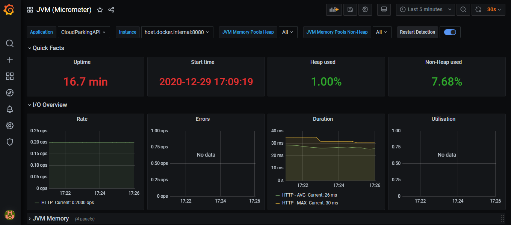

# Cloud Parking API

Application example using spring boot responsible for controlling vehicle parking

*This project makes reference to the cloud parking API developed by Sandro Giacomozzi. The solution presented in this repository includes Docker, Jenkins, Sonar, Prometheus, Grafana and coverage tests

### Tools

- Java SE Development Kit
- Spring Tools IDE
- Maven
- Docker
- ModelMapper
- Swagger
- Prometheus
- Grafana
- RestAssured
- Mockito
- Postgres
- TestContainers
- Sonar
- Jenkins
- Lombok

## Built with:

- [Spring Boot](https://spring.io/projects/spring-boot)
- [Maven](https://maven.apache.org/)

### Requeriments

- The project follows [**CloudNative**](https://www.cncf.io/) recommendations and The [**twelve-factor app**](https://12factor.net/) . 

## Solution

### Services

| Service Name             | Port       | Description                                       |
|--------------------------|------------|---------------------------------------------------|
| Prometheus               | 9090       | Responsible to captura(scrap) metrics in the API  |
| Grafana                  | 3000       | Diplay metrics on graphics                        | 
| Postgres Database        | 5432       | Storage data parkings                             |
| Sonar                    | 9000       | Responsible to Scan and check code quality        |
| Jenkins                  | 8083       | Responsible to provide automatic build            |
| Cloud Parking API        | 8080       | Management Parkings Solution                      |

### Parking API



### Jenkins

Jenkins is open source automation server. In this case, we set up the Jenkins file, which is responsible for customizing our automation pipeline.

For more details, please check [Jenkinsfile](Jenkinsfile).


### Sonar Qube

SonarQube is an automatic code review tool to detect bugs, vulnerabilities, and code smells in your code.
In this case, we use the tool to integrate with Jenkins through plugins with the intention of scanning the solution code.

For analysis of coverage tests the jacoco plugin was used. For more details check the [pom.xml](pom.xml).



### Prometheus

Prometheus is a monitoring platform that collects metrics from monitored targets by scraping metrics HTTP endpoints

To perform the API scrap we set up the [prometheus.yml](src/main/resources/prometheus.yml)

In addition to configuring the yml file, it is necessary to enable the display of our API metrics through the [application.properties](src/main/resources/application.properties).



### Grafana

Grafana is a opens source dashboard observabiliy. In this case i used a prometheus datasource to feed the data to the grafana



### Setup Containers

```sh
docker-compose up
```

